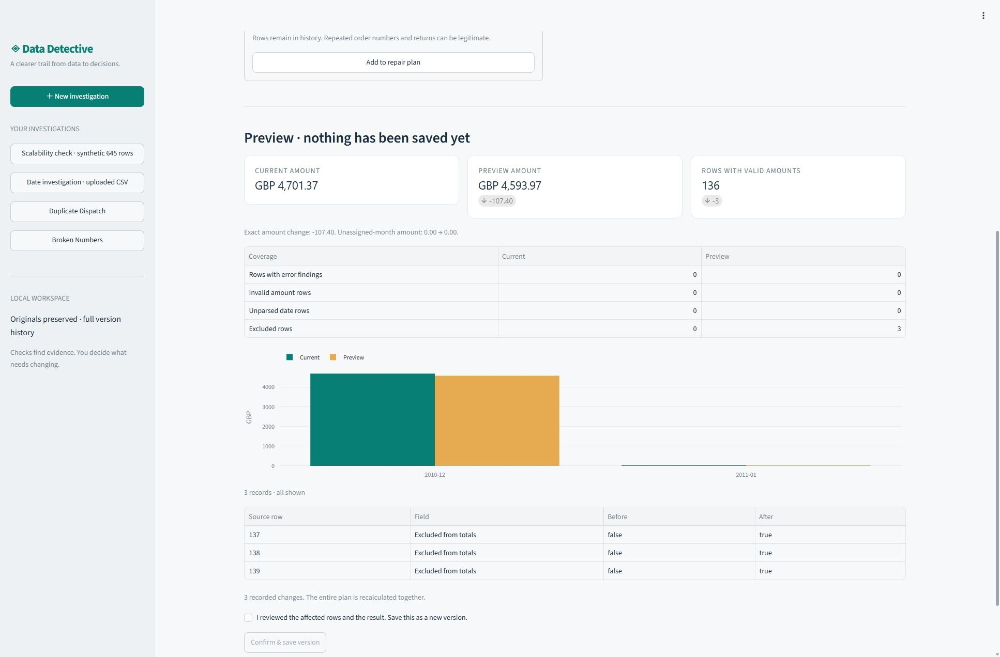

# Data Detective

Investigate a surprising sales total, inspect the underlying records, and preview a specific repair before saving it. Originals and every saved version remain available.

This is a **local, single-user application** built with Streamlit. Python checks and `Decimal` arithmetic produce the findings and amounts; pandas displays tables, and Plotly displays monthly comparisons. An optional local Qwen model suggests which existing findings to inspect. It cannot modify data or calculate the authoritative totals.



[Two-minute annotated UI walkthrough](docs/assets/walkthrough.mp4) · [Measured results and limitations](docs/RESULTS.md) · [中文学习笔记](docs/LEARNING_NOTES.zh-CN.md)

## Run locally

Python 3.12 or newer. From the repository root in PowerShell:

```powershell
py -3.12 -m venv .venv
.venv\Scripts\python.exe -m pip install -r requirements-windows.lock
.venv\Scripts\python.exe -m pip install --no-deps -e .
.\scripts\start.ps1 -Port 8503
```

The locks target Windows x64 / Python 3.12 and pin runtime package versions; they do not pin wheel hashes or build tools. On other platforms, use `python -m pip install -e .` and validate locally. The isolated Windows install and full test suite are recorded in [the installation report](reports/clean-install.json).

Open [http://127.0.0.1:8503](http://127.0.0.1:8503). The included cases need no download or model. If PowerShell script execution is unavailable, run the equivalent directly:

```powershell
.venv\Scripts\python.exe -m streamlit run app.py --server.port 8503 --server.address 127.0.0.1
```

Start with **Duplicate Dispatch**, inspect the identical-record findings, then use **Repair lab** to exclude only documented extra copies. **Preview combined impact** recalculates the complete proposed result. Saving requires an explicit confirmation; **History & export** restores an earlier state as another version and exports the evidence. The [two-minute demonstration](docs/DEMO_SCRIPT.md) gives exact rows and expected amounts.

## What is implemented

| Capability | Behavior |
|---|---|
| Confirm the data contract | Map order, product, quantity, price and transaction time; select date format, number separators and one currency. |
| Inspect deterministic findings | Missing required cells, numeric/date parse failures, exact duplicate records and within-product price outliers. Duplicates and outliers are review candidates. |
| Preview explicit operations | Replace selected cell values, exclude selected rows, trim outer whitespace or change parsing settings. Multiple operations are recalculated together. |
| Preserve evidence | Stable original row references, hash-verified snapshots, exact changes, reasons, preview fingerprints, stale-version checks and idempotent saves. |
| Export | Included rows as CSV, complete change log, investigation report, original file and optional row-reference CSV. |

The explorer searches the entire dataset and paginates findings, evidence and changes. The repair lab accepts exact source row numbers and ranges such as `27, 31, 501-505`, so every imported row is reachable. Draft operations, reasons and previews stay with each investigation during the current browser session; only confirmed versions survive a restart. Individual draft operations can be removed before recalculating.

Only the selected tab executes. Open **History & export → Prepare export files** to create a version-bound bundle, including a full findings-to-source-row CSV. Changing a restore target or reason requires a fresh confirmation. [Optimization details](docs/OPTIMIZATION.md).

The input contract is UTF-8 CSV, optionally with a BOM, at most **20 MiB and 50,000 data rows**. The UI supports comma, semicolon and tab separators. Malformed CSV is rejected; the application does not guess date or number formats. One file has one confirmed currency. Changing its label does not convert currencies.

Net transaction amount is the signed sum of quantity × unit price, **not accounting revenue**. Returns keep their signs. Invalid amounts are omitted from the total and counted visibly; a valid amount with an invalid date remains in the total but outside the monthly buckets.

## Optional local model

The rules workflow is the default and needs no GPU. To use Qwen, supply a local model directory and a Python environment with CUDA-enabled PyTorch. The real-model evaluation used **Python 3.12.0, PyTorch 2.11.0+cu128, Transformers 5.16.1 and Accelerate 1.14.0** on Windows. The optional model dependency group pins those tested library releases; other versions have not been validated. Its `torch==2.11.0` constraint accepts the tested `+cu128` build, but the extra alone does not select a CUDA wheel or install a GPU driver. Install a CUDA-enabled PyTorch build appropriate to your machine before adding the optional group:

```powershell
.venv\Scripts\python.exe -m pip install -e ".[model]"
$env:DATA_DETECTIVE_MODEL_PATH = "D:\models\Qwen3-4B-Instruct-2507"
.\scripts\start.ps1 -Port 8503
```

If GPU dependencies already exist in another environment, reuse it instead:

```powershell
$env:DATA_DETECTIVE_MODEL_PYTHON = "D:\Project\.venv\Scripts\python.exe"
$env:DATA_DETECTIVE_MODEL_PATH = "D:\models\Qwen3-4B-Instruct-2507"
.\scripts\start.ps1 -Port 8503
```

The launcher uses that existing `D:\Project\.venv` interpreter automatically when available and no override was provided. Other machines should set their own path. Model weights are not included or downloaded by the application. Uncached model requests use a disposable process, so latency includes loading; missing dependencies, unavailable weights, timeout or invalid responses produce a visible rules fallback. Validated successful suggestions can be reused from a bounded ten-minute memory cache for the same question, evidence and model fingerprint. The worker currently requires CUDA. Enable **Use the local AI model** only when this environment is ready.

## Verify and reproduce

```powershell
.venv\Scripts\python.exe -m pip install -r requirements-dev-windows.lock
.venv\Scripts\python.exe scripts/verify.py
.venv\Scripts\python.exe scripts/benchmark.py
.venv\Scripts\python.exe scripts/evaluate_advisor.py
```

`verify.py` checks this installed checkout, dependencies, lint, tests and all twelve cases, and writes commands, logs, source hashes and results to `reports/verification/`. It does not install dependencies or run the GPU; a source edit during verification invalidates the result. CI uses the same command.

The last command measures rules only. Add `--model` to perform actual local Qwen calls with the configured model interpreter; it records raw responses, protocol failures, fallbacks and cold-process latency. The included model evaluation found no improvement over rules on this small question set. CI is configured in `.github/workflows/check.yml`; it has not been run on a remote host.

The frozen corpus has **six development and six held-out cases**, with disjoint original source rows. [Data documentation](data/README.md) explains the attribution, deliberate edits, synthetic controls and regeneration commands. The [case report](reports/evaluation.md) measures known injections and oracle restoration; it does not treat the original retail data as clean. See [results and limitations](docs/RESULTS.md) for measured outcomes and environment details. The [future user-study protocol](docs/USER_STUDY.md) is a plan; no user-study benefit is claimed.

The CLI also supports a script-first workflow:

```powershell
.venv\Scripts\python.exe -m data_detective.cli --workspace workspace import data/cases/dev-duplicate-dispatch/input.csv --name "Duplicate investigation"
.venv\Scripts\python.exe -m data_detective.cli --workspace workspace list
.venv\Scripts\python.exe -m data_detective.cli --workspace workspace inspect DATASET_ID
.venv\Scripts\python.exe -m data_detective.cli --workspace workspace export DATASET_ID --out output
```

Replace `DATASET_ID` with the identifier returned by import/list. The CLI's `preview` and `apply` commands accept a JSON `RepairPlan`; `apply` requires the preview fingerprint and an idempotency key. The UI provides restore.

## Local storage and boundaries

- `workspace/detective.sqlite3`: investigation/version metadata and action keys.
- `workspace/datasets/<id>/original.csv`: exact imported bytes.
- `workspace/datasets/<id>/versions/`: hash-verified JSON snapshots; exclusion preserves source records.
- `data/cases/`: attributed small public/synthetic fixtures; `data/private/`: ignored full UCI download and receipt.
- `reports/`: reproducible benchmark output, not private uploaded datasets.

Use `scripts/start.ps1 -Workspace <path>` or `DATA_DETECTIVE_WORKSPACE` to choose another local workspace. The default workspace and private corpus directory are ignored by Git. Storage is not encrypted, and there is no authentication or multi-user deployment layer. The default listener is loopback. The current scope is explicit CSV investigation, not Excel import, accounting reconciliation, automatic cleaning, or causal diagnosis.

Source attribution: **Chen, D. (2015). Online Retail [Dataset]. UCI Machine Learning Repository. [DOI: 10.24432/C5BW33](https://doi.org/10.24432/C5BW33)**, licensed [CC BY 4.0](https://creativecommons.org/licenses/by/4.0/). Case manifests identify adaptations and synthetic additions.

Further reading: [Architecture](docs/ARCHITECTURE.md) · [中文学习笔记](docs/LEARNING_NOTES.zh-CN.md).
