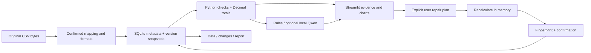

# Architecture and tradeoffs

Data Detective is a local investigation workflow. Its correctness boundary is the confirmed parsing contract and deterministic engine; optional model output stays outside that boundary.

## Data and computation

`DatasetVersion` carries the original column names, string-valued rows, five-field `ColumnMap`, `ParseSettings` and parent version. Imported row references combine the complete source-byte SHA-256 with the one-based data-record index. Quoted newlines do not create extra records. References survive edits and exclusions.

The CSV boundary checks encoding, quoting, column consistency, size and row count. Fields remain strings until interpreted under the selected date and number formats. The engine uses Python collections and `Decimal`, with bounded numeric inputs and explicit precision. pandas is a UI table adapter, not the financial calculation engine. At the 50,000-row scope, direct code makes the amount calculation and each finding easier to inspect than a second implicit coercion layer.

Findings distinguish **error** (missing required cells and parse failures) from **review** (identical complete records and price outliers). Order identifiers are not duplicate keys. A negative quantity or cancellation prefix alone does not establish an error. Product-price review requires at least ten valid prices and uses an explicit three-IQR rule; zero IQR still exposes prices differing from the repeated reference. This is a transparent heuristic, not a learned fraud or business-error classifier.

Totals use signed quantity × unit price. Failed amount parsing reduces amount coverage rather than silently inserting zero. Failed dates preserve valid amounts in a separate unassigned-month amount. Display values may be rounded; the engine, previews and reports retain exact decimal strings.

## Repair and persistence

The public repair surface is a `RepairPlan(base_version_id, operations, reason)`. Supported operations are `set_cell`, `exclude_rows`, `normalize_whitespace` and `change_settings`. They target explicit source row references. There is no code-execution operation and no inferred replacement value.

`preview_repair` copies the in-memory rows, applies the complete operation sequence, recalculates both versions, and returns exact cell/setting changes plus amount and monthly deltas. It writes nothing. Its fingerprint binds the original version content and complete plan. A saved repair is a new snapshot, not an overwrite.

`Store.apply` checks the fingerprint and active version, repeats the active-version check inside a SQLite `BEGIN IMMEDIATE` transaction, and records an idempotency key. Reusing a key for the same payload returns the previous saved version; reusing it for different content fails. This protects against duplicate clicks and stale previews in the local workflow, without claiming a distributed transaction protocol.

Snapshot files are written to a temporary file, flushed and renamed before SQLite commits the reference. A crash may leave an orphan file; it should not leave a committed reference to a half-written snapshot. Every snapshot load verifies its recorded SHA-256. The filesystem and SQLite are not one atomic transaction, and a complete workspace backup must retain both. Restore copies an earlier version's contents into a new version; it does not undo arithmetic or erase subsequent history.

## Assistant boundary

The rules assistant ranks available findings. Optional Qwen receives a bounded question and summaries of up to twenty findings, without tool access. It returns a constrained JSON recommendation referencing allowed finding IDs. Validation checks shape, references and explicit unsupported numeric/certainty language; it does **not** prove every sentence is semantically correct.

The model executes in a separate local process with offline model loading, a bounded prompt/output and a timeout. The parent app remains usable through the rules workflow when the worker fails. A cache miss reloads the model in a disposable worker. Validated successes can be reused from a bounded, ten-minute in-memory cache keyed by the question, evidence and model fingerprint; failures are never cached. Concurrent GPU requests are serialized within the application process and waiting consumes the timeout budget. The environment variable `DATA_DETECTIVE_MODEL_PYTHON` allows the small UI environment to reuse a separate GPU environment.

The v4 prompt sends rule-level guidance and source column names, without raw numeric/date examples. Wire aliases map back to existing finding IDs after validation. Candidate selection preserves rule-type coverage. This supports investigation prioritization; it does not infer which of two identical transactions is legitimate.

## Interface state and bounded work

Only the active Streamlit tab executes. `explorer.py` contains literal row search, finding filtering and explicit source-number selection independently of the UI. Pagination bounds rendered tables, while searches cover the whole dataset. A prepared export bundle is tied to one saved version and created only on request. Complete findings are available in a separate CSV rather than relying on truncated prose references.

Unsubmitted operations, preview fingerprints and reasons are retained by investigation during the browser session. Switching back to a changed base version invalidates the old repair plan. Each saved repair or restore clears its draft. Restore confirmation is tied to the base, target and reason. These controls are user-interface protections; the store independently enforces version and idempotency checks.

## Evidence and operating scope

The fixed corpus records source attribution, non-overlapping row windows, exact mutations, synthetic controls and hashes. Evaluation compares known injected edits against independent labels; an independent Decimal/ISO oracle checks financial results. Original findings outside the labelled edits are not counted as false positives by assuming the baseline is clean. Oracle repair success validates the repair engine, not autonomous decision-making.

Deployment is one user, one machine, loopback Streamlit and a local workspace. There is no authentication, shared-server tenancy, distributed worker queue or encrypted storage. The 20 MiB/50,000-row import contract bounds the intended workload; performance numbers belong in the measured results, not in the architecture assumptions.
