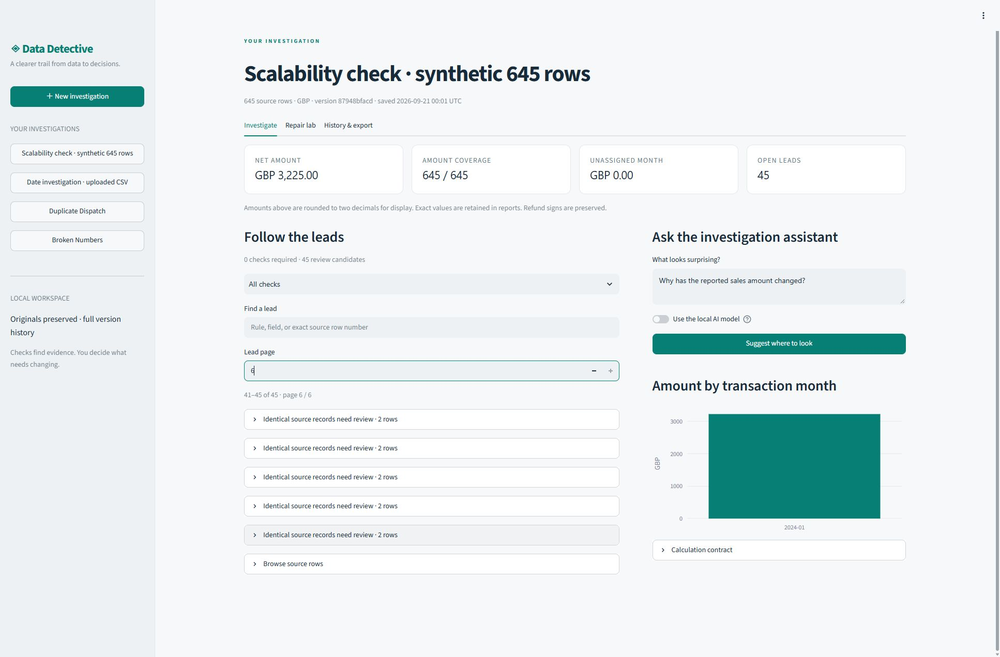

# Systematic optimization

This iteration addresses reachable data, predictable state, unnecessary computation, export correctness and reproducible verification. Existing SQLite tables and snapshot fields are unchanged; previously saved investigations remain readable.

## Workflow changes

| Previous behavior | Current behavior | Evidence |
|---|---|---|
| Only the first 40 findings appeared. | All findings are searchable and paginated, with errors displayed first. Each finding's evidence is paginated too. | Browser reached findings 41–45 of a 45-finding synthetic case. |
| Default repair selection stopped at the first 500 rows. | Search covers every included row; explicit source numbers and ranges reach the complete dataset. | Browser previewed source row 600: GBP 3,225.00 → 3,220.00, one row affected. |
| Switching investigations discarded unsaved work. | Operations, reasons and previews stay with their investigation in the current browser session. Clicking the current investigation preserves them. | Browser switched away and back with a three-row exclusion preview intact. |
| An operation could only be abandoned by clearing the entire plan. | Remove individual operations, then recalculate the combined result. | UI regression coverage. |
| Every tab executed on each interaction, including full exports. | Only the active tab executes. Version-bound export files are prepared explicitly and reused in the session. | Tests count export calls before/after preparation. |
| Restore confirmation was not tied to the chosen target. | Confirmation is tied to the current version, target version and reason. | Changing target or reason clears approval. |

Preview coverage now shows rows with error findings, invalid amounts, invalid dates and excluded rows. Newly flagged error rows are highlighted. Amount changes use neutral colors: increasing or decreasing a total is not inherently an improvement.

The full findings CSV contains every finding-to-row association. UI pagination no longer forces users to leave the application to investigate later records. The original row reference remains the audit identity; the interface accepts its stable one-based record number.

## Correctness and execution cost

CSV export now uses CRLF record endings, ensuring a quoted cell containing a lone carriage return remains one cell when reimported. This applies to processed data and the audit trail. Tests cover carriage returns, line feeds, quotes and round-trip row values.

Snapshot serialization now copies the required fields directly instead of recursively traversing every dataclass value through `asdict`. Its public representation stays identical, including detached nested values. Repair previews and saves detach mutable request collections so a caller cannot change the recorded request after it is checked. Historical export queries select the relevant version range without reloading a full snapshot to locate its metadata.

Analysis results carry the source version ID. Reports can reuse an analysis from that exact version; an explicitly mismatched result is rejected, and an old result without a version marker is recomputed. [Controlled serialization comparison](../reports/core-optimization.json) records raw runs, input construction, environment and hashes. It isolates the former `asdict` path, rather than claiming to benchmark a complete historical checkout.

On the 50,000-row synthetic fixture, three interleaved runs per path gave these medians:

| Measured scope | Restored old serialization path | Current path |
|---|---:|---:|
| Snapshot serialization | 115.85 ms | 18.54 ms |
| Complete repair preview | 583.47 ms | 477.34 ms |

The preview comparison isolates an 18.19% elapsed-time reduction on this machine. Browser rendering, persistent writes and model generation are outside this measurement. All twelve measured outputs passed semantic equivalence checks. Reproduce with `python scripts/benchmark_core.py`.

## Local AI

Prompt v4 sends bounded rule descriptions and field names, keeping raw amounts, dates and counts out of model prose inputs. Short aliases are mapped back to validated finding IDs. The candidate budget retains representatives of each available rule type; duplicate groups cannot consume the entire budget. The existing numeric, certainty and reference checks remain in force.

Successful validated responses can be cached in memory for ten minutes, up to 32 entries. The key includes the question, evidence identity, prompt version and model/interpreter fingerprint. Hits are validated again and copied before return; failures are not cached. Concurrent local model requests are serialized, with waiting counted against the timeout. No persistent model service or paid API is added.

In a diagnostic rerun of three existing questions, all three responses passed the protocol and first-rule rubric. Their cold-request median was **12.059 seconds**; repeated matching requests had a median of **0.673 milliseconds**. The corresponding older records had a median of 21.632 seconds, but these runs were taken at different times and are not a controlled hardware experiment. This is a reused smoke subset, not a fresh holdout or an estimate of general accuracy. The previous twelve-question result remains available and is not overwritten. [Raw responses and cache checks](../reports/advisor-optimization-smoke-v4.json).

## Verification and boundaries

Run `python scripts/verify.py` in the installed development environment. It checks that imports resolve to this checkout, checks dependencies and lint, runs tests and the twelve-case evaluation, and writes logs plus source hashes. A source change during execution invalidates the result. CI invokes the same command; no remote CI run is claimed. [Latest verification](../reports/verification/verification.md).

The completed optimization run passed **182 tests, zero skips**, dependency and lint checks, and the twelve-case regression gate, with no source changes during verification. This reused the previously isolated `.venv-clean`; it was not another fresh installation. The browser additionally exercised import, the sixth findings page, row-600 repair preview, cross-investigation draft retention, prepared exports, a real model request and a repeated cache hit. [Updated preview](assets/15-optimized-preview.png) · [Cached advice linked to evidence](assets/16-cached-advice.png).

Drafts and prepared exports are session memory, not durable saved versions. The original-file and immutable-version guarantees apply to confirmed saves. The initial walkthrough video predates these interface refinements; the demonstration script is updated. No real user study has been conducted, and no user time-saving claim is made.
